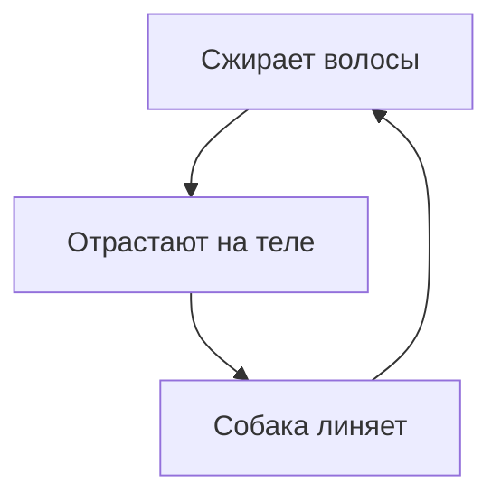

# Плюсы и минусы собаки

## За что мы любим братьев наших меньших
---

### Плюсы

1. Собака классный **компаньон**
2. Замечательный *охранник*

### Минусы

* Они ~~круглогодично~~ сезонно линяют

Собаки наши друзья 
 С любовью, Варя

Чтоб вернутся погладь собаку

[:dog:](README.md "Да, меня гладь!")
